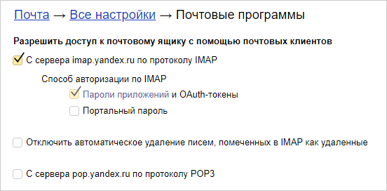

# Набор скриптов для получения OAuth токена
Скрипты используются для конфигурирования работы с почтовым сервером по протоколу OAuth.

Так как большинство провайдеров OAuth отказались от поддержки типа OAuth-авторизации password, то токен может быть получен только с участием пользователя.
Подробнее об этом типе предоставления доступа см. https://datatracker.ietf.org/doc/html/rfc6749#section-4.3

Для упрощения процесса получения токена добавлены скрипты PowerShell для Windows, и bash - для Linux.

# Скрипты для Яндекс.Почта
Для поддержки авторизации по протоколу OAuth в настройках должен быть включен флажок, под учетной записью, от имени которой будет выполняться авторизация.

[Настройка почтовых программ Яндекс.Почта](https://mail.yandex.ru/#setup/client)

Далее, в зависимости от использумого окружения, выберите скрипт на PowerShell или bash, см. папку [Yandex](/Yandex/)